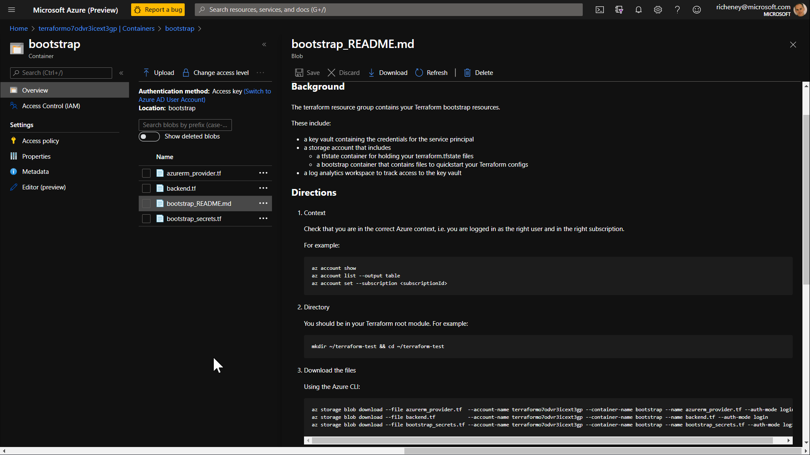

# terraform-bootstrap

## tl;dr

Creates service principal, Terraform remote state storage account and key vault.

1. `./bootstrap_backend.sh`
1. `mv terraform.tfvars.example terraform.tfvars` then edit
1. `terraform init`
1. `terraform apply`
1. View the bootstrap_README.md blob in the storage account's bootstrap container

If the script defaults have been selected then the resource group will be called terraform.

## Background

It is easy to set up a service principal in Azure for Terraform use, but in production there are some good questions:

1. Where do I store the credentials?
1. How do I give the right access to read those credentials?
1. How do I track who has accessed the credentials?
1. How do I safely reference those credentials without including secrets in my Terraform root modules?
1. What can those other root modules use as their backend state?

This repo addresses those concerns, and is helpful in bootstrapping a single tenant environment.

## Overview

Bootstraps a single tenant environment for Terraform use, creating:

* Azure Key Vault including access policies and set of secrets
* Log Analytics Workspace for logging secret access to the storage accounts
* Service Principal for Terraform use, with optional RBAC assignments
* RBAC assignments for the owner plus optional AAD group
* Resource lock on the resource group to avoid accidental deletes
* Set of outputs

## Context

Before running the bootstrap , log in on the CLI to Azure and check that you are in the right context using `az account show --output jsonc`

Your ID will need Owner level access to create the resources and role assignments.

Note that you will need an appropriate Azure Active Directory role to read group information if specifying a value for the terraform_state_aad_group variable.

## Bootstrap Script

Run the following command:

```bash
./bootstrap_backend.sh
```

The script will create

* resource group with you as Owner
* storage account (plus container) with you as Storage Blob Data Owner
* boostrap_backend.tf
* boostrap_backend.auto.tfvars containing
  * resource_group_name
  * storage_account_name
  * container_name
  * azurerm_version_constraint

> The azurerm_version will attempt to pull the latest version from the repo. E.g. "~> 2.15"

This is the minimum required for the Terraform config to run given that the state file for the config should also be stored safely in remote state.

## Overriding the variable defaults

If you wish to override the variable defaults then create a valid terraform.tfvars. Example below:

```terraform
terraform_state_aad_group = "terraform-state"

service_principal_name = "terraform"
service_principal_rbac_assignments = [
  {
    role  = "Contributor"
    scope = "/subscriptions/2d31be49-d959-4415-bb65-8aec2c90ba62"
  }
]
```

You will find an example file in the repo.

> The service_principal_rbac_assignments array defaults to [] and will therefore give the service principal no RBAC permissions. You can either define the role assignments here to capture it as code, or assign manually in the portal. Note that you can use `"Current"` as the scope value and it will be substituted with the subscriptionId for the current context.

## Terraform Apply

Run through the Terraform flow to create the resources

1. `terraform fmt`
1. `terraform init`
1. `terraform validate`
1. `terraform plan`
1. `terraform apply`

## Resources created

* Service principal with random password
* Key vault with access policies for owner and service principal
* Secrets for the client id and secret
* Log analytics workspace with setting for the key vault
* Storage account role assignments
* Optional RBAC role assignments if specified
* Generated files in the outputs subfolder

If an AAD group was specified then it will also be given access to the storage account and key vault.

## Outputs

### Terraform Outputs

E.g. `terraform output` or `terraform output tenant_id`

* Strings
  * tenant_id
  * resource_group_name
  * storage_account_name
  * storage_account_id
  * container_name
  * app_id
  * app_object_id
  * sp_object_id
  * client_id
  * key_vault_name
  * key_vault_id
* Array of objects
  * rbac_authorizations
* Multiline HCL text blocks
  * azurerm_provider
  * backend
  * client_secret
  * provider_variables
* Multiline Bash commands
  * environment_variables

Example use: `terraform output environment_variables >> ~/.bashrc`

> The app_id and client_id outputs are the same, but are provided for convenience.

### Output Files

The following files are generated, and may be copied into new Terraform root modules to quickly make use of the service principal, key vault and storage account.

* bootstrap/azurerm_provider.tf
* bootstrap/backend.tf
* bootstrap/bootstrap_README.tf
* bootstrap/bootstrap_secrets.tf

> You are not compelled to use the files as is, or at all.

These files are also available as blobs in the storage account's bootstrap container.



## Testing the outputs

1. Create a new directory containing the files. e.g.

    ```bash
    mkdir -m 755 /git/myTerraformTest
    cp bootstrap/*.tf /git/myTerraformTest
    cd /git/myTerraformTest
    ```

1. Edit the name of the key in the backend.tf file

1. Run through the

    1. `terraform init`
    1. `terraform validate`
    1. `terraform plan`
    1. `terraform apply`

The config will successfully use the service principal and store the state file in the storage account.

> Note that the storage account also includes a bootstrap_README.md in the bootstrap container for easy ongoing access.

## Future

The current repo is based around a single tenant approach. Will look at a natural flow for a cross-tenant example.

Allow existing service principals to be imported.

Define an array of AAD objectIds to have access to the blobs and secrets. This will cover security principals (both user and service), security groups and managed identities.
